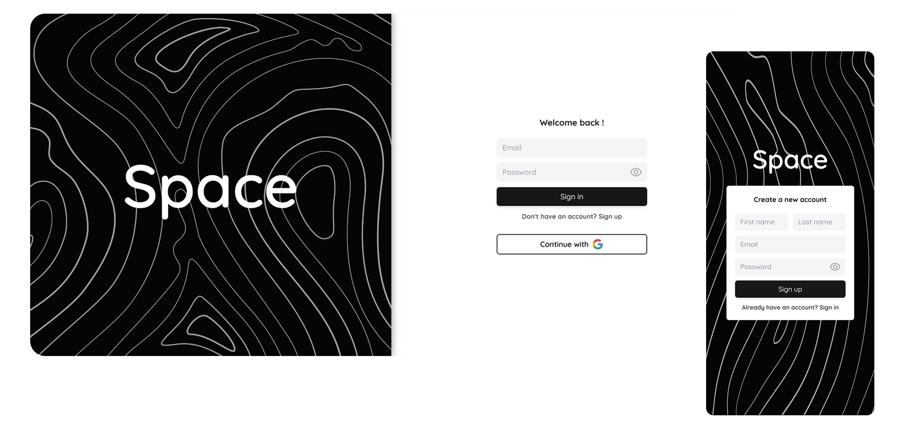
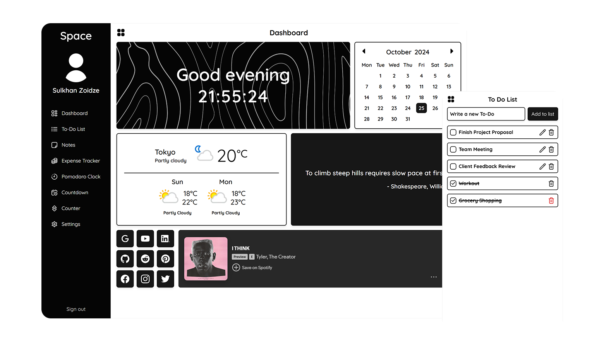

# Space

Welcome to **Space**, a comprehensive productivity web application designed to streamline your daily tasks and enhance your workflow. Space combines a variety of tools into a single, user-friendly platform to help you stay organized and efficient.

## Screenshots




## Features

- **User Authentication**: Secure sign-up and login with Firebase.
- **Data Storage**: All your data is safely stored in Firestore.
- **Dashboard**:
  - **Calendar**: View your schedule at a glance.
  - **Weather**: Get real-time weather updates for your current location.
  - **Random Quote**: Stay inspired with a random quote.
  - **Random Song**: Discover new music from Spotify.
- **To-Do List**: Create, manage, and track your tasks.
- **Notes**: Write and organize your notes.
- **Event Countdowns**: Set and view countdowns for important events.
- **Expense Calculator**: Keep track of your expenses and manage your budget.
- **Pomodoro Timer**: Improve your focus and productivity with the Pomodoro technique.
- **Basic Counter**: Use a simple counter for any counting needs.

## Tech Stack

- **Frontend**
  - React 18
  - Tailwind CSS
  - React Router v6
- **Backend**
  - Firebase
    - Authentication
    - Firestore Database

## Configuration

### Firebase Setup

1. Create a new Firebase project
2. Enable Authentication methods:
   - Email/Password
   - Google Sign-in
3. Create a Firestore database
4. Add Firebase config to `.env`

### API Setup

1. **WeatherAPI.com**

   - Sign up at [WeatherAPI.com](https://www.weatherapi.com)
   - Get your API key from the dashboard
   - Add to `.env` as `VITE_WEATHER_API_KEY`

2. **API Ninjas**
   - Register at [API Ninjas](https://api-ninjas.com)
   - Obtain your API key
   - Add to `.env` as `VITE_NINJAS_API_KEY`

### Database Structure

```
space/
├── users/
│   └── {userId}/
│       ├── displayName: string    # Display name
│       ├── photoURL: string       # Google profile photo URL
│       ├── uid: string            # Auto-generated Firebase user ID
│       │
│       ├── todos/
│       │   └── {todoId}/
│       │       ├── check: boolean
│       │       ├── dateTime: timestamp
│       │       └── text: string
│       │
│       ├── notes/
│       │   └── {noteId}/
│       │       ├── dateTime: timestamp
│       │       ├── title: string
│       │       └── text: string
│       │
│       └── countdown/
│           └── {countdownId}/
│               ├── date: number
|               └── title: string
```

### Collection Fields

#### User Document

```typescript
interface User {
  displayName: string;
  photoURL: string;
  uid: string;
}
```

#### Todo Document

```typescript
interface Todo {
  check: boolean;
  dateTime: Timestamp;
  text: string;
}
```

#### Note Document

```typescript
interface Note {
  dateTime: Timestamp;
  title: string;
  text: string;
}
```

#### Countdown Document

```typescript
interface Note {
  date: number;
  title: string;
}
```

## Installation

1. Clone the repository:

```bash
git clone https://github.com/Sulkhans/Space.git
cd Space
```

2. Install dependencies:

```bash
npm install
```

3. Set up environment variables:

```
# Firebase Config
VITE_FIREBASE_API_KEY=your_api_key
VITE_AUTH_DOMAIN=your_auth_domain
VITE_PROJECT_ID=your_project_id
VITE_STORAGE_BUCKET=your_storage_bucket
VITE_SENDER_ID=your_sender_id
VITE_APP_ID=your_app_id

# API Keys
VITE_WEATHER_API_KEY=your_weatherapi_key
VITE_NINJAS_API_KEY=your_api_ninjas_key
```

4. Start the development server:

```bash
npm run dev
```
